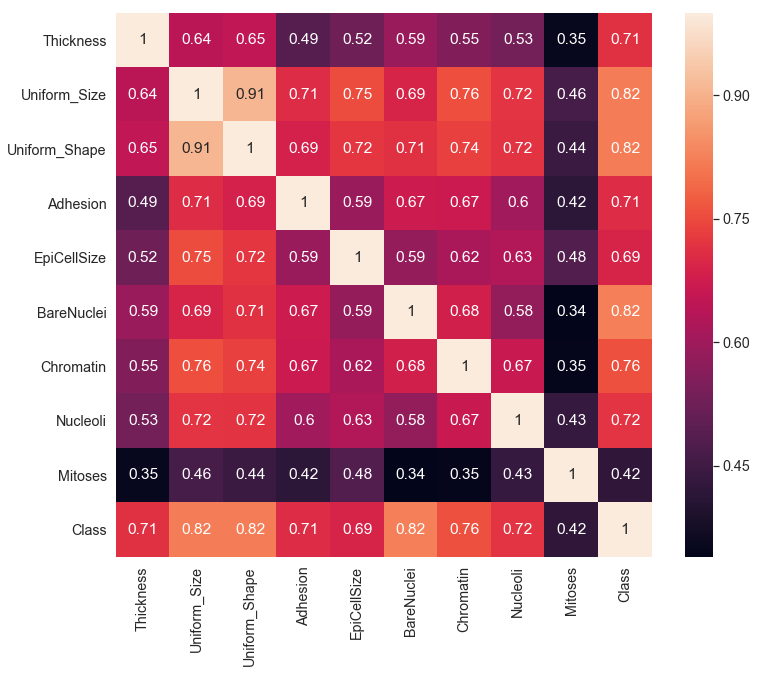

# Data Challenge - Breast Cancer Detection

Breast cancer is the most commonly occuring cancer among Canadian women as well as the second leading cause of death from cancer (The Canadian Cancer Society). With over 25,000 women diagnosed with breast cancer in 2017, early diagnosis is crucial factor for early treatment. Thus, the problem that this data challenge tackles is the development of a model that is able to predict whether a biopsied breast cell is benign (not harmful) or malignant (cancerous), given a set of attributes about the cell. 

## Data
The dataset was obtained from the University of Wisconsin Hospitals, Madison. Specifically, bioposied breast cells measured on 10 cytology characteristics. The breast cancer dataset was from the University of Wisconsin Hospitals, Madison. Details of the dataset can be found and downloaded [here](https://archive.ics.uci.edu/ml/datasets/Breast+Cancer+Wisconsin+(Original)). Specific dataset used in this data challenge has also been uploaded in this repository. To address the presence of class-imbalance, 

## Features
Ordinal variables (each valued from 1-10) measure the magnitude of the characteristics. A total of  cell shape uniformity, cell size uniformity, adhesion, nuclei properties..

## Model

## Evaluation

## Reference
William H. Wolberg and O.L. Mangasarian: "Multisurface method of pattern separation for medical diagnosis applied to breast cytology", Proceedings of the National Academy of Sciences, U.S.A., Volume 87, December 1990, pp 9193-9196. 
