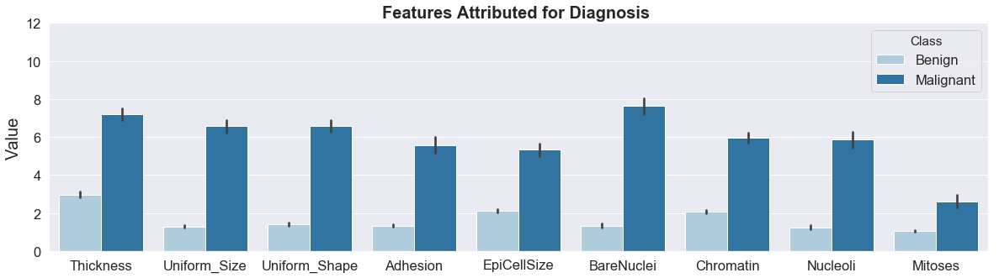

# Data Challenge - Breast Cancer Detection

Breast cancer is the most commonly occuring cancer as well as the second leading cause of death from cancer among Canadian women (The Canadian Cancer Society). With over 25,000 women diagnosed with breast cancer in 2017, early diagnosis is crucial for successful treatment. Thus, the problem that this data challenge tackles is the development of a model that is able to predict whether a biopsied breast cell is benign (not harmful) or malignant (cancerous), given a set of attributes about the cell. 

## Data
The dataset was from the University of Wisconsin Hospitals, Madison. Specifically, bioposied breast cells measured on 10 cytology characteristics. The breast cancer dataset was from the University of Wisconsin Hospitals, Madison. Details of the dataset can be found and downloaded [here](https://archive.ics.uci.edu/ml/datasets/Breast+Cancer+Wisconsin+(Original)). Specific dataset used in this data challenge has also been uploaded in this repository. To address the presence of clas imbalance, SMOTE was used as a oversampling technique and various performance metrics beyond accuracy as well as a Random Forest Classifier was selected. While other methods such as downsampling, oversampling and SMOTE exists, these were not implemented due to time contraints for this data challenge. 

## Features
Ordinal variables (each valued from 1-10) measure the magnitude of the characteristics. A total of 9 features (ex. cell shape uniformity, cell size uniformity, adhesion, nuclei properties ...) were present to predict the 'Class' or whether the biopsied cell was benign or malignant. 

## Model and Evaluation 
Tackling this data challenge as a classification problem and due to the presence of class imbalance, a random forest model was selected. Specifically, the splitting rules used in the creation of the trees can allow both classes to be addressed. Evaluation of the model performance included not just accuracy but also include confusion matrix, precision score, ROC and PR curves.

## Reference
William H. Wolberg and O.L. Mangasarian: "Multisurface method of pattern separation for medical diagnosis applied to breast cytology", Proceedings of the National Academy of Sciences, U.S.A., Volume 87, December 1990, pp 9193-9196. 
